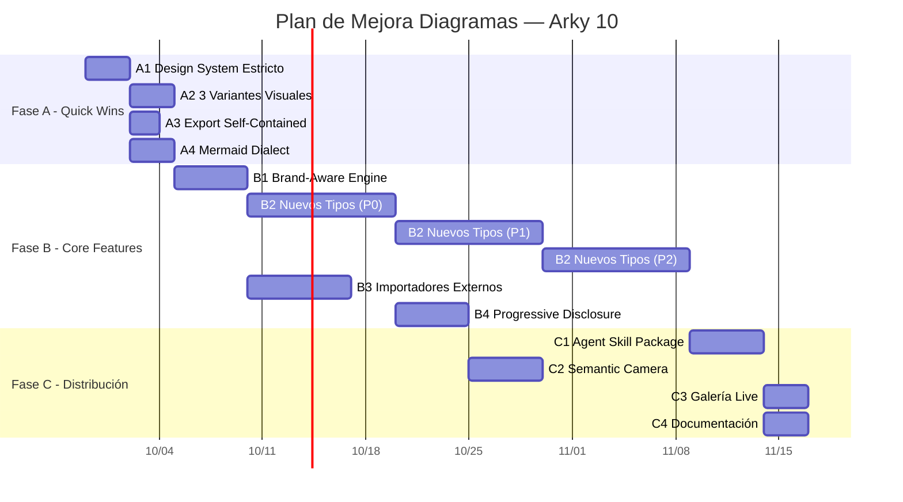

# Plan de Mejora del Pipeline de Diagramas — Arky 10

**Basado en análisis comparativo de:**
- **Archify** (tt-a1i/archify) — Agent skill para diagramas técnicos desde lenguaje natural
- **diagram-design** (cathrynlavery/diagram-design) — 27-40+ diagramas editoriales brand-aware

**Fecha:** 2026-09-28
**Estado:** Borrador para revisión y ejecución
**Objetivo:** Potenciar el pipeline de diagramas de arky-sup con capacidades diferenciadoras de ambos proyectos

---

## RESUMEN EJECUTIVO

| Métrica | Actual | Objetivo Post-Plan |
|---------|--------|-------------------|
| Tipos de diagrama | 6 (arquitectura, flujo, secuencia, estado, C4, BPMN) | **22+** (incl. quadrant, radar, loop, pyramid, Gantt, org chart, medallion, DP matrix, etc.) |
| Variantes visuales | 2 (light/dark) | **3 por tipo** (minimal-light, minimal-dark, full-editorial) |
| Brand-aware | ❌ No | ✅ Auto-extracción colores/fuentes de web cliente |
| Importación externa | Solo Mermaid | **draw.io, Lucidchart, PlantUML, Mermaid** |
| Progressive disclosure | Zoom/pan básico | **MAP → READ → FULL** estructurado |
| Distribución | Solo app integrada | **Agent Skill instalable** (Cursor, Claude Code, Codex, OpenCode) |
| Design system | Tailwind primario | **Estricto**: 1 accent, 3 fuentes, coords % 4, 1px hairline, no shadows |

---

## FASE A — QUICK WINS (Semanas 1-2)
**Objetivo:** Mejoras de bajo esfuerzo, alto impacto visual y de compatibilidad inmediata
**Beneficio:** Consistencia profesional, compatibilidad Mermaid real, export portable, base para fases posteriores

### A1 — Design System Estricto
**Objetivo:** Aplicar reglas visuales inquebrantables que eliminan el "look AI-generated"
**Beneficio:** Diagramas listos para presentación ejecutiva sin retoques manuales; coherencia visual automática

**Tareas:**
1. **Definir tokens base** en `lib/diagramTokens.ts`:
   - `spacingUnit = 4` (todas las coords, widths, gaps divisibles por 4)
   - `borderWidth = 1` (hairline), `borderRadiusMax = 10`
   - `shadow = 'none'` (prohibido)
   - Fuentes: `fontTitle = 'Instrument Serif'`, `fontUI = 'Geist Sans'`, `fontMono = 'Geist Mono'`
   - Paleta: 1 accent color + grises neutros; coral-tint para nodos focales (máx 2 por diagrama)

2. **Aplicar a ReactFlow** en `components/reactFlowCanvas/CustomNode.tsx` y `CustomEdge.tsx`:
   - Eliminar `boxShadow`, `filter: drop-shadow`
   - Forzar `rx={10}` máx en nodos rectangulares
   - Usar `fontFamily` según rol semántico (title/UI/mono)
   - Edge labels en `fontMono` tamaño 11px

3. **Aplicar a Excalidraw** en `irToExcalidraw.ts`:
   - `strokeWidth: 1`, `roughness: 0` (salvo variante sketchy)
   - Fuentes mapeadas a equivalentes Excalidraw

4. **Tests visuales** en `e2e/diagram-design-system.spec.ts`:
   - Render 6 tipos × 3 variantes × 2 temas = 36 screenshots
   - Assert: coords % 4 === 0, borderWidth === 1, no box-shadow en DOM

---

### A2 — 3 Variantes Visuales por Tipo
**Objetivo:** Ofrecer minimal-light, minimal-dark, full-editorial sin configuración manual
**Beneficio:** Un diagrama, tres audiencias (trabajo diario, docs técnicas, presentaciones ejecutivas)

**Tareas:**
1. **Extender `DiagramIR`** en `services/diagram/index.ts`:
   ```typescript
   interface DiagramIR {
     // ... existente
     variant: 'minimal-light' | 'minimal-dark' | 'full-editorial';
     brandTheme?: BrandTheme; // para fase B1
   }
   ```

2. **Crear `variantPresets.ts`** (nuevo archivo):
   ```typescript
   export const variantPresets = {
     'minimal-light': { background: '#ffffff', grid: false, annotations: false, density: 'low' },
     'minimal-dark':  { background: '#0f172a', grid: false, annotations: false, density: 'low' },
     'full-editorial': { background: 'var(--bg)', grid: true, annotations: true, density: 'target-4-of-10' }
   };
   ```

3. **Propagar a renderers**:
   - `irToReactFlow.ts`: leer `variant` → aplicar preset → `CustomNode/Edge` consumen via context
   - `irToExcalidraw.ts`: mismo enfoque
   - `diagramExportFrame.ts`: incluir variant en export HTML

4. **UI toggle** en `components/artifacts/diagram/DiagramToolbar.tsx`:
   - Selector de 3 variantes (iconos: □, ▣, ◆)
   - Persistir en `Artifact.metadata.variant`

---

### A3 — Validar Export Self-Contained
**Objetivo:** Garantizar que `diagramExportFrame.ts` genera HTML+SVG 100% autocontenido
**Beneficio:** Archivos portables, versionables en Git, abiertos en cualquier navegador sin red

**Tareas:**
1. **Auditar `diagramExportFrame.ts`**:
   - Verificar: fuentes embebidas (base64 data: URLs o Google Fonts @import inline)
   - Verificar: sin `<script src="https://...">`, sin CDN
   - Verificar: SVG inline o ``
   - Verificar: CSS completo inline (sin Tailwind JIT en runtime)

2. **Corregir fugas** encontradas:
   - Mover `diagramTokens.css` → inline style tag
   - Embebir Geist/Instrument Serif via `@font-face` con data: URLs (subset latin)
   - Reemplazar `lucide-react` icons por SVG inline

3. **Test E2E** en `e2e/diagram-export-selfcontained.spec.ts`:
   - Abrir export en `file://` protocol → sin errores de consola, render idéntico
   - Validar tamaño < 500 KB para diagrama medio (50 nodos)

---

### A4 — Mermaid como Input Dialect (Semántico, no Mecánico)
**Objetivo:** Leer Mermaid por estructura y hacer layout from scratch en estilo arky
**Beneficio:** Usuarios pegan Mermaid existente → sale diagrama arky sin "Mermaid slop"

**Tareas:**
1. **Extender `mermaidToIR.ts`** con heurísticas semánticas:
   - `subgraph` → `lane` (workflow) o `region` (architecture)
   - `classDef` con `fill:` → `semanticType` mapping (database, api, security, external)
   - `shape: diamond` / `{}` → `decision` / `security` node
   - `-->|label|` → `edgeLabel` (usar con parsimonia)
   - `flowchart TB/TD/LR/RL` → inferir `direction` en `layoutDirective`

2. **No parsear mecánicamente**: usar regex + heurísticas, no parser Mermaid completo
   - Regla: "read for structure, lay out from scratch in matching archify mode"

3. **Test fixtures** en `tests/fixtures/mermaid-dialect/`:
   - 10 casos: architecture, flowchart, sequence, C4, BPMN, ER, etc.
   - Assert: IR result tiene `semanticType` en ≥80% nodos, `layoutDirective` coherente

---

## FASE B — CORE FEATURES (Semanas 3-7)
**Objetivo:** Diferenciadores competitivos que ningún competidor tiene integrado
**Beneficio:** Posicionamiento único — diagramas brand-aware, tipos empresariales, migración zero-friction, UX progresiva

### B1 — Brand-Aware Engine (Auto-extracción de identidad visual)
**Objetivo:** Dada una URL, extraer colores/fuentes y generar `DiagramTheme` personalizado en < 3s
**Beneficio:** Diagramas que "encajan" en la web/docs del cliente automáticamente; cero configuración manual

**Tareas:**
1. **Crear `services/diagram/brandExtractor.ts`** (nuevo):
   ```typescript
   interface BrandTheme {
     colors: { accent: string; bg: string; fg: string; muted: string; border: string };
     fonts: { title: string; ui: string; mono: string };
     sourceUrl: string;
     extractedAt: number;
   }
   ```

2. **Extracción de colores** (prioridad):
   - CSS custom properties: `--color-primary`, `--brand-accent`, `:root` vars
   - Meta tags: `<meta name="theme-color">`, `<meta property="og:image">` (dominant color)
   - Favicon/apple-touch-icon → color dominante via canvas
   - Fallback: paleta por defecto (Tailwind primary)

3. **Extracción de fuentes**:
   - `@import url(https://fonts.googleapis.com/...)` → parsear familia
   - `@font-face` declarations → font-family names
   - `font-family` en `body` / headings → inferir stack
   - Mapear a: title (serif preferido), ui (sans), mono (monospace)

3. **Cache por dominio** (24h en `localStorage` + `sessionStorage`):
   - Key: `arky.brandTheme.{hostname}`
   - Invalidar en `SettingsPage` botón "Refrescar tema"

4. **Integrar en pipeline**:
   - `diagramTypeInference.ts`: si `brandTheme` presente → override tokens
   - `diagramTypeQualityGates.ts`: validar contraste WCAG AA con colores extraídos
   - `components/artifacts/diagram/DiagramToolbar.tsx`: badge "Brand: example.com" + botón reset

5. **Tests**:
   - 5 sitios reales (Stripe, Linear, Vercel, GitHub, Supabase) → temas generados pasan revisión visual manual
   - Fallback probado: sitio sin CSS vars → usa paleta por defecto sin error

---

### B2 — 15+ Nuevos Tipos de Diagrama Editorial
**Objetivo:** Cubrir casos de uso de arquitectura empresarial que hoy no existen
**Beneficio:** Arky-sup se convierte en herramienta completa para arquitectos (no solo diagramas técnicos)

**Tipos a implementar (prioridad):**
| Prioridad | Tipo | Caso de uso | Referencia diagram-design |
|-----------|------|-------------|---------------------------|
| P0 | **Quadrant** | Matriz impacto/esfuerzo, tecnología/madurez | `type-quadrant.md` |
| P0 | **Radar/Spider** | Comparativa multi-eje (capacidades, riesgos) | `type-radar.md` |
| P0 | **Loop/Flywheel** | Bucles de valor, flywheels organizacionales | `type-loop.md` |
| P1 | **Pyramid/Funnel** | Jerarquía rankada, drop-off funnel | `type-pyramid.md` |
| P1 | **Consultant 2×2** | Matriz escenarios con celdas nombradas | `type-consultant2x2.md` |
| P1 | **Org Chart** | Propiedad, routing, reporting lines | `type-orgchart.md` |
| P1 | **Tree/Nested** | Jerarquía por contención (dominios, módulos) | `type-tree.md`, `type-nested.md` |
| P1 | **Venn** | Overlap de capacidades, dominios, equipos | `type-venn.md` |
| P2 | **Layer Stack** | Abstracciones apiladas (infra, platform, app) | `type-layerstack.md` |
| P2 | **Timeline/Gantt** | Eventos en eje temporal, fases de proyecto | `type-timeline.md`, `type-gantt.md` |
| P2 | **Charts** | Bar, Line, Scatter — métricas arquitectónicas | `type-barchart.md`, `type-linechart.md`, `type-scatter.md` |
| P2 | **Process** | Multi-actor sequential workflow | `type-process.md` |
| P2 | **Medallion** | Multi-tier data storage (bronze/silver/gold) | `type-medallion.md` |
| P2 | **Data Flow** | Role-scoped pipeline steps | `type-dataflow.md` |
| P2 | **DP Integration/Security Matrix** | Sources→core→consumers, per-role permissions | `type-dpintegration.md`, `type-dpsecurity.md` |

**Tareas por tipo (repetir para cada uno):**
1. **Definir esquema IR** en `diagramTypeInference.ts` → `DiagramType` union + `typeConfig[type]`
2. **Layout directive** en `layoutDirective.ts` + `groupSemantics.ts` (semantic groups → zones)
3. **Renderer ReactFlow** en `irToReactFlow.ts` (nodos/edges específicos, handles, labels)
4. **Renderer Excalidraw** en `irToExcalidraw.ts`
5. **Quality gates** en `diagramTypeQualityGates.ts` (reglas específicas por tipo)
6. **Accessibility summary** en `accessibleSummary.ts` (descripción textual para screen readers)
7. **Test fixture** en `tests/fixtures/diagram-types/{type}.json` + snapshot test

**Infraestructura compartida:**
- `groupZoneSeparation.ts`: zonas semánticas por tipo (lanes, regions, quadrants, rings)
- `edgeRoutingPolicy.ts`: routing policies por tipo (orthogonal, curved, straight)
- `layoutSelector.ts`: elegir Dagre/ELK/custom por tipo

---

### B3 — Importadores Externos (Migración Zero-Friction)
**Objetivo:** Importar draw.io, Lucidchart, PlantUML, Mermaid → IR → render arky
**Beneficio:** Adopción inmediata — equipos migran diagramas existentes sin redibujar

**Tareas:**
1. **Crear carpeta** `services/diagram/import/`
2. **Implementar importadores** (cada uno archivo independiente):
   - `drawioToIR.ts`: parsear `.drawio` (XML) → mxGraph model → IR
   - `lucidToIR.ts`: usar `services/lucid/` (ya existe integración) → IR
   - `plantumlToIR.ts`: parsear PlantUML texto → AST → IR (subset: component, sequence, class)
   - `mermaidToIR.ts`: reutilizar/mejorar A4

3. **CLI unificada** en `bin/arky-diagram.mjs` (nuevo):
   ```bash
   npx arky-diagram import diagram.drawio --output diagram.json --type architecture
   npx arky-diagram import diagram.lucid --output diagram.json
   npx arky-diagram render diagram.json --variant full-editorial --output diagram.html
   npx arky-diagram validate diagram.json --type architecture
   ```

4. **UI en app** — `components/artifacts/diagram/DiagramImportWizard.tsx`:
   - Drag & drop archivo → detectar formato → preview IR → confirmar → crear artifact

5. **Tests**: 3 archivos por formato → IR válido → render sin errores

---

### B4 — Progressive Disclosure MAP → READ → FULL
**Objetivo:** Navegación semántica por 3 niveles de detalle en mismo diagrama
**Beneficio:** Ejecutivos ven MAP (contexto), técnicos ven READ (detalle), expertos ven FULL (todo)

**Tareas:**
1. **Extender `DiagramIR`** con `detailLevels`:
   ```typescript
   interface DiagramIR {
     // ... existente
     detailLevels: {
       map: DiagramIR;      // Solo contenedores + conexiones principales
       read: DiagramIR;     // Contenedores + nodos clave + edges etiquetados
       full: DiagramIR;     // Todo (actual)
     };
     currentLevel: 'map' | 'read' | 'full';
   }
   ```

2. **Implementar `audienceProjector.ts`** (ya existe, completar):
   - `projectToMap(ir)`: agrupar nodos por `semanticGroup` → super-nodos; edges = conexiones entre grupos
   - `projectToRead(ir)`: nodos con `prominence >= 0.5` + edges con `label`
   - `projectToFull(ir)`: identity

3. **ReactFlow canvas** — `components/reactFlowCanvas/`:
   - Toolbar: 3 botones MAP/READ/FULL (atajos 1/2/3)
   - Transición animada (Motion): fade + reposition (300ms)
   - Persistir nivel en `Artifact.metadata.detailLevel`

4. **Semantic camera** (base para Fase C2):
   - `storyPlanner.ts` genera `CameraPath[]` por nivel
   - MAP: vista completa; READ: zoom a zona activa; FULL: pan recorrido

5. **Tests**: 5 diagramas complejos → 3 niveles → cada nivel renderiza < 2s, sin loss semántico

---

## FASE C — DISTRIBUCIÓN & POLISH (Semanas 8-10)
**Objetivo:** Empaquetar como skill distribuible, pulir UX, documentar
**Beneficio:** Adopción viral vía agent skills; arky-sup como "diagram engine" headless de referencia

### C1 — Agent Skill Package (Instalable en Cursor/Claude Code/Codex/OpenCode)
**Objetivo:** Publicar `npx skills add eltata71/arky-sup --skill arky-diagram`
**Beneficio:** Distribución viral; arky-sup usado como motor de diagramas en cualquier IDE

**Tareas:**
1. **Crear estructura** `.claude/skills/arky-diagram/`:
   ```
   arky-diagram/
   ├── SKILL.md              # Frontmatter + instrucciones principales
   ├── references/
   │   ├── type-architecture.md
   │   ├── type-quadrant.md
   │   ├── ... (uno por tipo)
   │   ├── brand-extraction.md
   │   ├── progressive-disclosure.md
   │   ├── import-export.md
   │   └── style-guide.md
   ├── bin/
   │   └── arky-diagram.mjs  # CLI: render, validate, check, demo
   ├── assets/
   │   └── index.html        # Galería live con tabs
   └── examples/
       ├── architecture.json
       ├── quadrant.json
       └── ... (10+ ejemplos)
   ```

2. **`SKILL.md`** — puntos clave:
   - Trigger: "diagrama", "architecture diagram", "quadrant", "make a diagram"
   - Lee `style-guide.md` del proyecto usuario (brand-aware)
   - Genera `.arky-diagram/{type}.json` + `.arky-diagram/{type}.html`
   - Valida con `node bin/arky-diagram.mjs validate`

3. **`bin/arky-diagram.mjs`** comandos:
   - `render <type> <input.json> <output.html>`
   - `validate <type> <input.json> --json`
   - `check <output.html>`
   - `demo [output-dir]` → genera 10 ejemplos listos

4. **Publicar**: `npx skills add` apunta a `github:eltata71/arky-sup` subpath `.claude/skills/arky-diagram`

---

### C2 — Semantic Camera + Path-Aware Stories
**Objetivo:** Animaciones guiadas por narrativa (no solo zoom/pan)
**Beneficio:** Presentaciones ejecutivas diferenciadoras; "cuenta la historia" del diagrama

**Tareas:**
1. **Completar `storyPlanner.ts`** y `storyDerivation.ts`:
   - Input: `DiagramIR` + `audience` (executive/technical/operations)
   - Output: `Story{ scenes: Scene[]; cameraPath: CameraKeyframe[] }`
   - Scene = { nodes: string[], focus: string, narration: string, duration: number }

2. **Camera engine** en `components/reactFlowCanvas/`:
   - `useSemanticCamera(story)` → controla viewport via `ReactFlowViewport`
   - Keyframes: position (x,y,z), target node, easing
   - Controles: play/pause, next/prev scene, speed

3. **Narración opcional**: TTS via `speechSynthesis` (accesibilidad) o export a script

4. **Export story** → MP4/GIF via `ascii-video` skill o captura pantalla

---

### C3 — Galería Live (Showcase Interactivo)
**Objetivo:** `skills/arky-diagram/assets/index.html` con tabs por tipo y variante
**Beneficio:** Demo inmediata sin instalar; referencia visual para usuarios y agentes

**Tareas:**
1. **HTML estático** (sin build, sin JS externo):
   - Grid de tarjetas: tipo × variante (3) × tema (light/dark)
   - Click → abre diagrama HTML en nueva pestaña
   - Filtros: search, category, variant

2. **Generar en build** — script `scripts/generate-gallery.mjs`:
   - Lee `examples/*.json` → render cada variante → embed en gallery

3. **Hostear** en `tt-a1i.github.io/arky-diagram/` (GitHub Pages) o Vercel preview

---

### C4 — Documentación y Ejemplos Completos
**Objetivo:** 10+ ejemplos JSON IR por tipo + guías de uso
**Beneficio:** Onboarding sin fricción; agentes y humanos aprenden patrones correctos

**Tareas:**
1. **Ejemplos** en `.claude/skills/arky-diagram/examples/`:
   - Por tipo: architecture, quadrant, radar, loop, pyramid, orgchart, tree, venn, layerstack, timeline, gantt, barchart, linechart, scatter, process, medallion, dataflow, dpintegration, dpsecurity
   - Cada uno: `input.json` (IR), `output.html` (full-editorial), `README.md` (explicación)

2. **Guías** en `references/`:
   - `style-guide.md` — design system completo (tokens, reglas, anti-patrones)
   - `brand-extraction.md` — cómo funciona, cómo personalizar, troubleshooting
   - `progressive-disclosure.md` — cuándo usar cada nivel, mejores prácticas
   - `import-export.md` — formatos soportados, limitaciones, round-trip

3. **Validación automática**: `node bin/arky-diagram.mjs check examples/*.html` en CI

---

## CRITERIOS DE ACEPTACIÓN GLOBALES

| Gate | Comando | Umbral |
|------|---------|--------|
| TypeScript strict | `npm run typecheck:strict` | 0 errores |
| ESLint | `npm run lint` | 0 errores, 0 warnings |
| Module boundaries | `npm run check:module-boundaries` | 0 ciclos dominio, 0 pares ascendentes, 0 fan-out >2 |
| Bundle budget | `npm run check:bundle-budget` | Carga inicial ≤ 340 KB gz; Dashboard ≤ 60 KB gz |
| Tests unitarios | `npm run test:ci` | 4 733+ tests passing |
| Coverage | `npm run test:coverage` | ≥ 67% statements, ≥ 58% branches |
| E2E | `npm run e2e` | 36 casos passing (Chromium desktop) |
| Supabase contracts | `bash scripts/supabase/local.sh verify` | 18 pgTAP contracts passing |
| Secrets | `npm run check:bundle-secrets` | Limpio |
| Any budget | `npm run check:any-budget` | ≤ 7 `any` (actual) |

---

## RIESGOS Y MITIGACIONES (Resumen)

| Riesgo | Prob. | Impacto | Mitigación |
|--------|-------|---------|------------|
| Brand extractor falla en SPAs | Media | Medio | Fallback a paleta por defecto; cache 24h; opt-in |
| 15+ tipos rompen quality gates | Alta | Alto | TDD 1 tipo a la vez; `diagramTypeQualityGates.ts` extensible |
| Bundle size se dispara | Media | Alto | `check:bundle-budget` por ruta; lazy-load Excalidraw/Lucid; code-split por tipo |
| Skill no instala en Windows | Baja | Medio | CI matrix (ubuntu/windows/mac); `run.sh` sin `make` |
| Mermaid dialect ambiguo | Media | Bajo | Heurísticas conservadoras; fallback "workflow"; log warnings |
| Cambios en `DiagramIR` rompen artifacts existentes | Media | Alto | Migración `irMigration.ts` (ya existe); versionar IR; tests de compatibilidad |

---

## SECUENCIA DE EJECUCIÓN RECOMENDADA



**Total estimado:** 10 semanas (≈ 50 días laborables)
**Entregables incrementales:** Cada fase produce valor usable independientemente

---

## PRÓXIMOS PASOS INMEDIATOS

1. **Revisar y aprobar** este plan (comentarios en PR o issue)
2. **Crear rama** `feat/diagram-pipeline-enhancement`
3. **Iniciar Fase A1** — Design System Estricto (base para todo lo demás)
4. **Daily sync** en standup: avance, bloqueos, decisiones de diseño
5. **PR por fase** (no mega-PR): A1→A2→A3→A4 → merge → B1→B2...

---

## ARCHIVOS CLAVE A MODIFICAR (Referencia Rápida)

```
lib/diagramTokens.ts              # A1 - Tokens base
lib/diagramThemes.ts              # A1, A2, B1 - Temas y variants
services/diagram/index.ts         # A2, B4 - DiagramIR extensions
services/diagram/variantPresets.ts # A2 - NUEVO
services/diagram/brandExtractor.ts # B1 - NUEVO
services/diagram/mermaidToIR.ts   # A4 - Extender
services/diagram/diagramTypeInference.ts # B2 - Nuevos tipos
services/diagram/irToReactFlow.ts # A1, A2, B2 - Renderers
services/diagram/irToExcalidraw.ts # A1, A2, B2 - Renderers
services/diagram/diagramTypeQualityGates.ts # B2 - Gates por tipo
services/diagram/audienceProjector.ts # B4 - Progressive disclosure
services/diagram/storyPlanner.ts  # C2 - Stories
services/diagram/import/          # B3 - NUEVA CARPETA
components/reactFlowCanvas/       # A1, A2, B4, C2 - Canvas
components/artifacts/diagram/     # A2, A3, B1, B3 - Toolbar, Import, Export
services/diagram/diagramExportFrame.ts # A3 - Export
.claude/skills/arky-diagram/      # C1, C3, C4 - NUEVA CARPETA
bin/arky-diagram.mjs              # C1, C3 - CLI
tests/fixtures/                   # A4, B2 - Fixtures
e2e/                              # A1, A3, B1, B2, B4 - Tests
```

---

**Fin del documento — Listo para revisión y ejecución fase a fase**